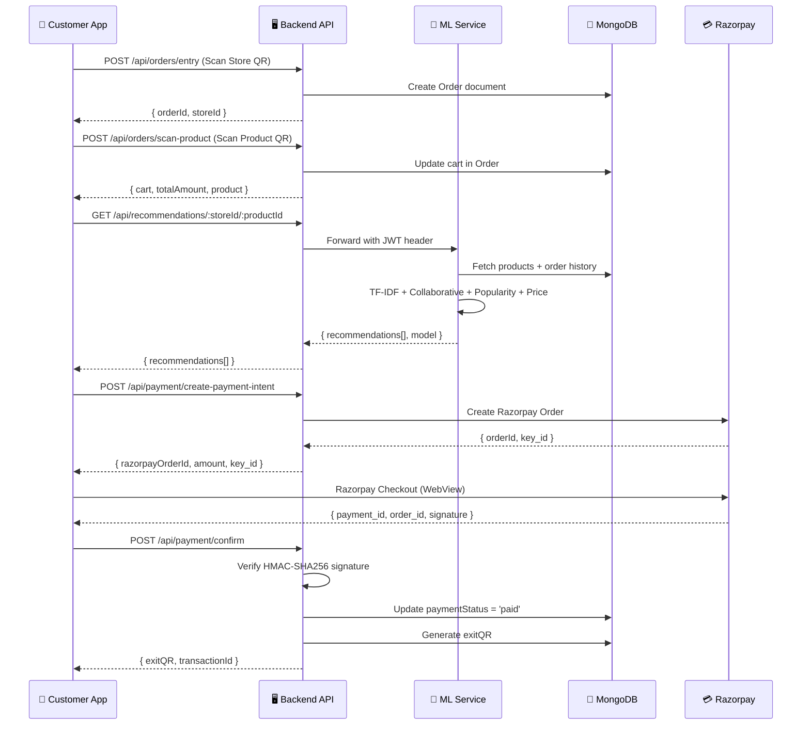

<p align="center">
  
</p>

<h1 align="center">SmartQR — AI-Powered Self-Checkout System</h1>

<p align="center">
  <strong>Cashier-less shopping with QR codes, real-time monitoring, and intelligent product recommendations</strong>
</p>

<p align="center">
  
  
  
  
  
  
  
  
</p>

<p align="center">
  
  
  
  
</p>

---

## 📋 Table of Contents

- [Overview](#-overview)
- [Architecture](#-architecture)
- [Features](#-features)
- [Tech Stack](#-tech-stack)
- [ML Recommendation Engine](#-ml-recommendation-engine)
- [Project Structure](#-project-structure)
- [Getting Started](#-getting-started)
- [Environment Variables](#-environment-variables)
- [Deployment](#-deployment)
- [API Reference](#-api-reference)
- [User Flow](#-user-flow)
- [Contributing](#-contributing)

---

## 🎯 Overview

**SmartQR** is a full-stack, microservices-based self-checkout platform that eliminates traditional billing queues in retail stores. The system enables a seamless, cashier-less shopping experience:

1. 📱 **Customers** use a mobile app to scan a store's entry QR → scan product QR codes to add items → pay digitally via Razorpay → exit using a verified QR code
2. 🖥️ **Shopkeepers** manage their store through a web dashboard with real-time customer monitoring, product management, analytics, and exit QR validation
3. 🤖 **AI Engine** provides personalized product recommendations using a hybrid ML model combining 4 scoring signals

> **Why SmartQR?**  
> Traditional retail billing creates 10-15 minute queues during peak hours. SmartQR reduces checkout time to under 30 seconds with complete digital payment tracking and real-time inventory management.

---

## 🏗️ Architecture

```
┌─────────────────────────────────────────────────────────────────────┐
│                        CLIENT LAYER                                │
│                                                                     │
│   📱 React Native App (Expo)          🌐 React Dashboard (Vite)    │
│   ├── Store Entry QR Scan             ├── Login / Register          │
│   ├── Product QR Scan                 ├── Product Management        │
│   ├── Cart Management                 ├── Real-time Monitoring      │
│   ├── Razorpay Payment                ├── Analytics & Charts        │
│   ├── Exit QR Display                 ├── Exit QR Validation        │
│   └── AI Recommendations              └── Order History             │
│                                                                     │
└──────────────┬─────────────────────────────────┬────────────────────┘
               │          HTTPS                  │
               ▼                                 ▼
┌─────────────────────────────────────────────────────────────────────┐
│                      API LAYER (Node.js + Express)                  │
│                                                                     │
│   🔐 Auth          🏪 Stores         📦 Products     🛒 Orders     │
│   JWT + bcrypt     CRUD + GeoJSON    CRUD + QR Gen   Cart + Exit    │
│                                                                     │
│   💳 Payments      📧 Email          🔄 ML Proxy                   │
│   Razorpay +       PDF Invoice +     Forwards to                   │
│   HMAC Verify      Nodemailer        Python Service                 │
│                                                                     │
└──────────────┬───────────────────────────────────┬──────────────────┘
               │                                   │
               ▼                                   ▼
┌──────────────────────────┐       ┌──────────────────────────────────┐
│   🍃 MongoDB Atlas       │       │   🤖 ML Service (Python + Flask) │
│                          │       │                                  │
│   Collections:           │◄──────│   TF-IDF Content Filtering       │
│   ├── customers          │       │   Collaborative Filtering        │
│   ├── stores             │       │   Popularity Scoring             │
│   ├── products           │       │   Price Proximity                │
│   └── orders             │       │   Hybrid Weighted Scoring        │
│                          │       │                                  │
│   Indexes:               │       │   Weights:                       │
│   ├── 2dsphere (geo)     │       │   Content=35% | Collab=30%      │
│   ├── Compound indexes   │       │   Popular=20% | Price=15%       │
│   └── Text indexes       │       │                                  │
└──────────────────────────┘       └──────────────────────────────────┘
```

### Service Communication Flow



---

## ✨ Features

### 📱 Customer Mobile App (React Native + Expo)

| Feature | Description |
|---------|-------------|
| **Store Entry QR** | Scan store's unique QR code to begin a shopping session |
| **Product Scanner** | Scan product QR codes to instantly add items to cart |
| **AI Recommendations** | Receive ML-powered product suggestions after scanning an item |
| **Cart Management** | Increase/decrease quantities, remove items, view running total |
| **Razorpay Payment** | Secure in-app payment via WebView with server-side signature verification |
| **Exit QR Code** | Auto-generated post-payment QR for validated store exit |
| **Nearby Stores** | Discover stores using GPS with GeoJSON 2dsphere queries |
| **Profile Management** | View/edit customer profile and order history |

### 🖥️ Shopkeeper Dashboard (React + Vite)

| Feature | Description |
|---------|-------------|
| **Store Registration** | JWT-authenticated store owner onboarding |
| **Product Management** | Full CRUD with Cloudinary image upload and auto QR generation |
| **Live Monitoring** | Real-time view of active shoppers, their carts, and time spent |
| **Analytics** | Revenue charts (daily/weekly/monthly), sales funnels, top products |
| **Exit Validation** | Scan customer's exit QR to verify purchase and authorize exit |
| **Order History** | Filter orders by payment status, date range, with customer details |
| **Low Stock Alerts** | Automatic alerts when product stock falls below threshold |

### 🤖 AI Recommendation Engine (Python + Flask)

| Feature | Description |
|---------|-------------|
| **Content-Based Filtering** | TF-IDF vectorization on product text + cosine similarity |
| **Collaborative Filtering** | Co-purchase pattern analysis from historical order data |
| **Popularity Scoring** | Product purchase frequency normalization |
| **Price Proximity** | Inverse normalized price distance for budget-relevant suggestions |
| **Hybrid Scoring** | Weighted combination (35/30/20/15) of all 4 signals |
| **Smart Exclusion** | Auto-excludes scanned item + items already in customer's cart |
| **Explainable AI** | Human-readable tags: "Same Category", "Frequently Bought Together", etc. |

---

## 🛠️ Tech Stack

### Frontend & Mobile

| Technology | Purpose | Version |
|-----------|---------|---------|
| React | Shopkeeper Dashboard UI | 18.2 |
| Vite | Build tool & dev server | 4.4 |
| React Router | Client-side routing | 6.15 |
| React Native | Cross-platform mobile app | Expo SDK |
| Expo | Development & build toolchain | Latest |
| expo-camera | QR code scanning | Latest |
| expo-location | Geolocation services | Latest |
| Tailwind CSS | Utility-first styling | 3.3 |
| Axios | HTTP client | 1.7 |
| Cloudinary | Product image CDN | API v2 |

### Backend

| Technology | Purpose | Version |
|-----------|---------|---------|
| Node.js | Runtime environment | 18+ |
| Express.js | REST API framework | 4.18 |
| Mongoose | MongoDB ODM | 7.5 |
| JWT (jsonwebtoken) | Stateless authentication | 9.0 |
| bcryptjs | Password hashing | 2.4 |
| Razorpay SDK | Payment processing | 2.9 |
| PDFKit | Invoice PDF generation | 0.18 |
| Nodemailer | Email delivery | 6.10 |
| QRCode | QR code generation | 1.5 |

### ML Service

| Technology | Purpose | Version |
|-----------|---------|---------|
| Python | ML service runtime | 3.11 |
| Flask | Lightweight web framework | 3.1 |
| scikit-learn | TF-IDF, cosine similarity | 1.6 |
| NumPy | Numerical computation | 2.2 |
| Pandas | Data manipulation | 2.2 |
| PyMongo | Direct MongoDB driver | 4.12 |
| Gunicorn | Production WSGI server | 23.0 |

### Infrastructure

| Technology | Purpose |
|-----------|---------|
| MongoDB Atlas | Cloud-hosted NoSQL database (free tier) |
| Render | Backend + ML service hosting (free tier) |
| Vercel | Frontend static site hosting (free tier) |
| Expo EAS | Mobile APK cloud builds |
| GitHub | Version control (monorepo) |

---

## 🤖 ML Recommendation Engine

The recommendation engine uses a **hybrid scoring model** that combines 4 independent signals:

```
Final Score = (Content × 0.35) + (Collaborative × 0.30) + (Popularity × 0.20) + (Price × 0.15)
```

### Signal Breakdown

#### 1. Content-Based Filtering (Weight: 35%)
```python
# TF-IDF Vectorization on product text features
vectorizer = TfidfVectorizer(stop_words='english', max_features=500, ngram_range=(1, 2))
tfidf_matrix = vectorizer.fit_transform(corpus)
similarities = cosine_similarity(tfidf_matrix[0:1], tfidf_matrix[1:])
```
- Builds text corpus from product **name + category (3× weighted) + description**
- Uses TF-IDF with bigrams (ngram_range 1-2) for semantic matching
- Computes cosine similarity between scanned product and all candidates

#### 2. Collaborative Filtering (Weight: 30%)
```python
# Co-purchase pattern mining from order history
past_orders = db.orders.find({
    'storeId': store_id, 'paymentStatus': 'paid',
    'cart.productId': scanned_product_id
})
# Count co-occurrence frequency, normalize by max
```
- Analyzes up to 200 past orders containing the scanned product
- Counts how often each candidate appears alongside the scanned product
- Normalizes by maximum co-purchase count

#### 3. Popularity Scoring (Weight: 20%)
- Aggregates purchase counts across 300 recent paid orders in the store
- Considers quantity per purchase (not just order count)
- Normalizes to [0, 1] range

#### 4. Price Proximity (Weight: 15%)
```python
# Inverse normalized price distance
score = 1.0 - (|candidate_price - scanned_price| / max_price_diff)
```
- Products with similar prices score higher
- Uses inverse normalization so closer prices get higher scores

### Output Example
```json
{
  "recommendations": [
    {
      "name": "Whole Wheat Bread",
      "price": 45,
      "category": "Bakery",
      "score": 78.4,
      "reasons": ["Same Category", "Frequently Bought Together"]
    }
  ],
  "model": "hybrid-tfidf-collaborative-v1"
}
```

---

## 📁 Project Structure

```
Smart-QR/
├── backend/                          # Node.js REST API
│   ├── server.js                     # Express app entry point
│   ├── package.json
│   ├── .env                          # Environment variables (git-ignored)
│   ├── models/
│   │   ├── Customer.js               # Customer schema
│   │   ├── Store.js                  # Store schema (GeoJSON location)
│   │   ├── Product.js                # Product schema
│   │   └── Order.js                  # Order schema (cart, transactions, activity logs)
│   ├── routes/
│   │   ├── customerRoutes.js         # Register, login, profile (customer)
│   │   ├── storeRoutes.js            # Register, login, CRUD, geolocation (store)
│   │   ├── productRoutes.js          # CRUD, QR generation (products)
│   │   ├── orderRoutes.js            # Entry, scan-product, cart, exit-verify
│   │   ├── paymentRoutes.js          # Razorpay create + confirm + signature verify
│   │   ├── shopkeeperRoutes.js       # Analytics, monitoring, order filtering
│   │   └── recommendationRoutes.js   # ML service proxy
│   └── utils/
│       └── emailService.js           # PDF invoice generation + email delivery
│
├── shopkeeper-frontend/              # React Shopkeeper Dashboard
│   ├── index.html
│   ├── vite.config.js
│   ├── package.json
│   ├── .env                          # VITE_API_BASE_URL (git-ignored)
│   └── src/
│       ├── App.jsx                   # Route definitions
│       ├── main.jsx                  # Entry point
│       ├── index.css                 # Global styles + design system
│       └── components/
│           ├── Login.jsx             # Shopkeeper login
│           ├── Register.jsx          # Store registration
│           ├── Dashboard.jsx         # Stats, charts, overview
│           ├── AddProduct.jsx        # Add product with image upload
│           ├── Monitor.jsx           # Real-time customer tracking
│           ├── ValidateQR.jsx        # Exit QR scanner & validator
│           ├── Analytics.jsx         # Revenue charts, sales data
│           └── Layout.jsx            # Sidebar + topbar wrapper
│
├── MyFirstApp/                       # React Native Customer App
│   ├── App.js                        # Navigation setup
│   ├── app.json                      # Expo configuration
│   ├── eas.json                      # EAS Build profiles
│   ├── config.js                     # API_BASE_URL configuration
│   ├── package.json
│   ├── screens/
│   │   ├── HomeScreen.js             # Store QR scan + nearby stores
│   │   ├── LoginScreen.js            # Customer login
│   │   ├── RegisterScreen.js         # Customer registration
│   │   ├── ProductScanScreen.js      # Product QR scanner + cart overlay
│   │   ├── CartScreen.js             # Cart management
│   │   ├── PaymentScreen.js          # Razorpay WebView checkout
│   │   ├── ExitQRScreen.js           # Display exit QR code
│   │   ├── ProfileScreen.js          # Customer profile
│   │   └── RecommendationModal.js    # AI recommendations bottom sheet
│   ├── utils/
│   │   └── beep.js                   # Scan feedback sound
│   └── assets/
│       ├── icon.png                  # App icon
│       ├── splash-icon.png           # Splash screen
│       └── beep.mp3                  # Scan audio feedback
│
├── ml-recommendation-service/        # Python ML Microservice
│   ├── app.py                        # Flask app + RecommendationEngine class
│   ├── requirements.txt              # Python dependencies
│   ├── .env                          # MONGO_URI, JWT_SECRET (git-ignored)
│   └── venv/                         # Python virtual environment (git-ignored)
│
└── README.md                         # This file
```

---

## 🚀 Getting Started

### Prerequisites

- **Node.js** v18+ and npm
- **Python** 3.11+
- **MongoDB Atlas** account (free tier)
- **Expo CLI** (`npm install -g expo-cli`)
- **EAS CLI** (`npm install -g eas-cli`) — for APK builds
- **Git**

### 1. Clone the Repository

```bash
git clone https://github.com/Smart-Checkout-org/SMART-QR.git
cd SMART-QR
```

### 2. Setup Backend

```bash
cd backend
npm install

# Create .env file
cp .env.example .env    # or create manually (see Environment Variables section)

# Start the server
npm run dev    # Uses nodemon for hot reload
# OR
npm start      # Production mode
```

### 3. Setup ML Service

```bash
cd ml-recommendation-service

# Create virtual environment
python -m venv venv
source venv/bin/activate    # Linux/Mac
# venv\Scripts\activate     # Windows

# Install dependencies
pip install -r requirements.txt

# Create .env file (see Environment Variables section)

# Start the service
python app.py
```

### 4. Setup Shopkeeper Frontend

```bash
cd shopkeeper-frontend
npm install

# Create .env file (see Environment Variables section)

# Start dev server
npm run dev
```

### 5. Setup Mobile App

```bash
cd MyFirstApp
npm install

# Update config.js with your backend URL

# Start Expo dev server
npx expo start

# Scan QR code with Expo Go app on your phone
```

---

## 🔐 Environment Variables

### Backend (`backend/.env`)

```env
MONGO_URI=mongodb+srv://<username>:<password>@<cluster>.mongodb.net/smartqr?retryWrites=true&w=majority
JWT_SECRET=your_secure_jwt_secret_here
RAZORPAY_KEY_ID=rzp_test_xxxxxxxxxxxxxxx
RAZORPAY_SECRET_KEY=your_razorpay_secret
EMAIL_USER=your_email@gmail.com
EMAIL_PASS=your_app_password
PORT=5000
SERVER_HOST=0.0.0.0
ML_SERVICE_URL=http://127.0.0.1:5001
```

### ML Service (`ml-recommendation-service/.env`)

```env
MONGO_URI=mongodb+srv://<username>:<password>@<cluster>.mongodb.net/smartqr?retryWrites=true&w=majority
JWT_SECRET=your_secure_jwt_secret_here    # Must match backend
ML_PORT=5001
ML_HOST=0.0.0.0
FLASK_DEBUG=true
```

### Shopkeeper Frontend (`shopkeeper-frontend/.env`)

```env
VITE_API_BASE_URL=http://localhost:5000
VITE_CLOUDINARY_CLOUD_NAME=your_cloud_name
VITE_CLOUDINARY_UPLOAD_PRESET=your_upload_preset
```

### Mobile App (`MyFirstApp/config.js`)

```javascript
const API_BASE_URL = 'http://<YOUR_LOCAL_IP>:5000';  // For development
// const API_BASE_URL = 'https://your-backend.onrender.com';  // For production
export default API_BASE_URL;
```

> ⚠️ **Important**: Never commit `.env` files to Git. They are included in `.gitignore`.

---

## 🌐 Deployment

### Architecture in Production

| Service | Platform | Type |
|---------|----------|------|
| Backend API | Render | Node.js Web Service |
| ML Service | Render | Python Web Service |
| Shopkeeper Dashboard | Vercel | Static Site (Vite) |
| Customer App | Expo EAS | Android APK |
| Database | MongoDB Atlas | Free M0 Cluster |

### Deploy Backend (Render)

1. Connect GitHub repo on [render.com](https://render.com)
2. **Root Directory**: `backend`
3. **Build Command**: `npm install`
4. **Start Command**: `node server.js`
5. Add all env vars (set `PORT=10000`, `ML_SERVICE_URL=https://your-ml-service.onrender.com`)

### Deploy ML Service (Render)

1. Create another Web Service on Render
2. **Root Directory**: `ml-recommendation-service`
3. **Build Command**: `pip install -r requirements.txt`
4. **Start Command**: `gunicorn app:app --bind 0.0.0.0:$PORT --timeout 120`
5. Add env vars (`MONGO_URI`, `JWT_SECRET`, `PYTHON_VERSION=3.11.0`)

### Deploy Frontend (Vercel)

1. Import project on [vercel.com](https://vercel.com)
2. **Root Directory**: `shopkeeper-frontend`
3. **Framework**: Vite
4. Add env vars (`VITE_API_BASE_URL=https://your-backend.onrender.com`)

### Build Mobile APK (Expo EAS)

```bash
cd MyFirstApp

# Update config.js with production backend URL
# const API_BASE_URL = 'https://your-backend.onrender.com';

eas login
eas build --platform android --profile preview
# Download APK from expo.dev dashboard
```

---

## 📡 API Reference

### Authentication

| Method | Endpoint | Description |
|--------|----------|-------------|
| POST | `/api/customers/register` | Register new customer |
| POST | `/api/customers/login` | Customer login (returns JWT) |
| GET | `/api/customers/profile` | Get customer profile |
| POST | `/api/stores/register` | Register new store |
| POST | `/api/stores/login` | Store owner login (returns JWT) |

### Store Management

| Method | Endpoint | Description |
|--------|----------|-------------|
| GET | `/api/stores/:id` | Get store details |
| PUT | `/api/stores/:id` | Update store info |
| POST | `/api/stores/nearby` | Find nearby stores (GeoJSON) |
| GET | `/api/stores/all/list` | List all stores |

### Products

| Method | Endpoint | Description |
|--------|----------|-------------|
| POST | `/api/products/add` | Add new product (with image) |
| GET | `/api/products/store/:storeId` | Get all products for a store |
| PUT | `/api/products/:id` | Update product |
| DELETE | `/api/products/:id` | Delete product |

### Orders & Cart

| Method | Endpoint | Description |
|--------|----------|-------------|
| POST | `/api/orders/entry` | Create order (store entry scan) |
| POST | `/api/orders/scan-product` | Add product to cart |
| GET | `/api/orders/current-order/:storeId` | Get active order |
| POST | `/api/orders/update-cart` | Update cart quantities |
| POST | `/api/orders/verify-exit` | Validate exit QR code |

### Payments

| Method | Endpoint | Description |
|--------|----------|-------------|
| POST | `/api/payment/create-payment-intent` | Create Razorpay order |
| POST | `/api/payment/confirm` | Verify payment signature & confirm |

### ML Recommendations

| Method | Endpoint | Description |
|--------|----------|-------------|
| GET | `/api/recommendations/:storeId/:productId` | Get AI recommendations |

### Analytics (Shopkeeper)

| Method | Endpoint | Description |
|--------|----------|-------------|
| GET | `/api/shopkeeper/stats/:storeId` | Store statistics |
| GET | `/api/shopkeeper/monitor/:storeId` | Active customers |
| GET | `/api/shopkeeper/orders/:storeId` | Filtered order history |

### Health Checks

| Method | Endpoint | Service |
|--------|----------|---------|
| GET | `/health` | Backend API |
| GET | `/health` | ML Service |

---

## 🔄 User Flow

### Customer Journey

```
┌──────────────┐     ┌──────────────┐     ┌──────────────┐
│   Open App   │────▶│  Login /     │────▶│  Scan Store  │
│              │     │  Register    │     │  Entry QR    │
└──────────────┘     └──────────────┘     └──────┬───────┘
                                                  │
                     ┌──────────────┐     ┌───────▼───────┐
                     │  View AI     │◀────│  Scan Product │
                     │  Recommend.  │     │  QR Code      │
                     └──────┬───────┘     └───────┬───────┘
                            │                     │
                            ▼                     ▼
                     ┌──────────────┐     ┌──────────────┐
                     │  Add to Cart │────▶│  View Cart   │
                     │  (from AI)   │     │  & Checkout  │
                     └──────────────┘     └──────┬───────┘
                                                  │
                     ┌──────────────┐     ┌───────▼───────┐
                     │  Show Exit   │◀────│  Pay via      │
                     │  QR Code     │     │  Razorpay     │
                     └──────┬───────┘     └───────────────┘
                            │
                            ▼
                     ┌──────────────┐
                     │  Shopkeeper  │
                     │  Validates   │
                     │  Exit QR     │
                     └──────────────┘
```

### Shopkeeper Journey

```
Register Store → Add Products (with images) → Share Store Entry QR
     ↓
Monitor Active Customers (real-time) → View Analytics
     ↓
Validate Exit QR → Stock Auto-Deducted → Invoice Emailed to Customer
```

---

## 📊 Project Metrics

| Metric | Value |
|--------|-------|
| Total Codebase | ~12,000 lines across 45 source files |
| Backend Endpoints | 20+ RESTful API endpoints |
| Route Modules | 7 (customer, store, product, order, payment, shopkeeper, recommendation) |
| Database Models | 4 schemas with 5 compound indexes |
| ML Scoring Signals | 4-signal hybrid model |
| Mobile Screens | 9 screens + 1 modal |
| Dashboard Pages | 8 components (including analytics) |
| Services | 4 independently deployable microservices |
| Payment Security | HMAC-SHA256 server-side signature verification |

---

## 🤝 Contributing

1. Fork the repository
2. Create a feature branch (`git checkout -b feature/amazing-feature`)
3. Commit changes (`git commit -m 'Add amazing feature'`)
4. Push to branch (`git push origin feature/amazing-feature`)
5. Open a Pull Request

---

## 📄 License

This project is for educational and demonstration purposes.

---

<p align="center">
  Built with ❤️ by the SmartQR Team
</p>
